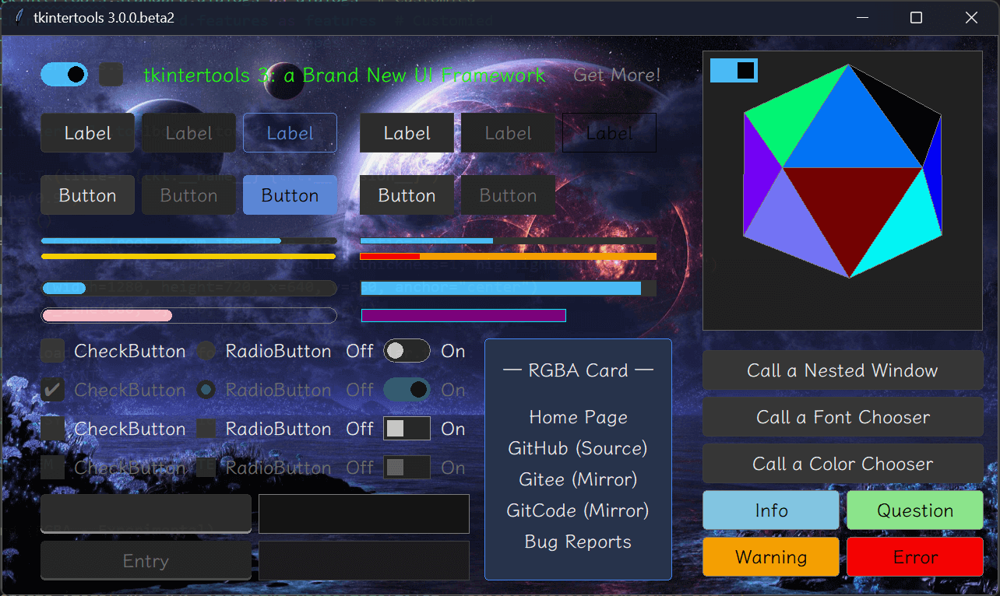
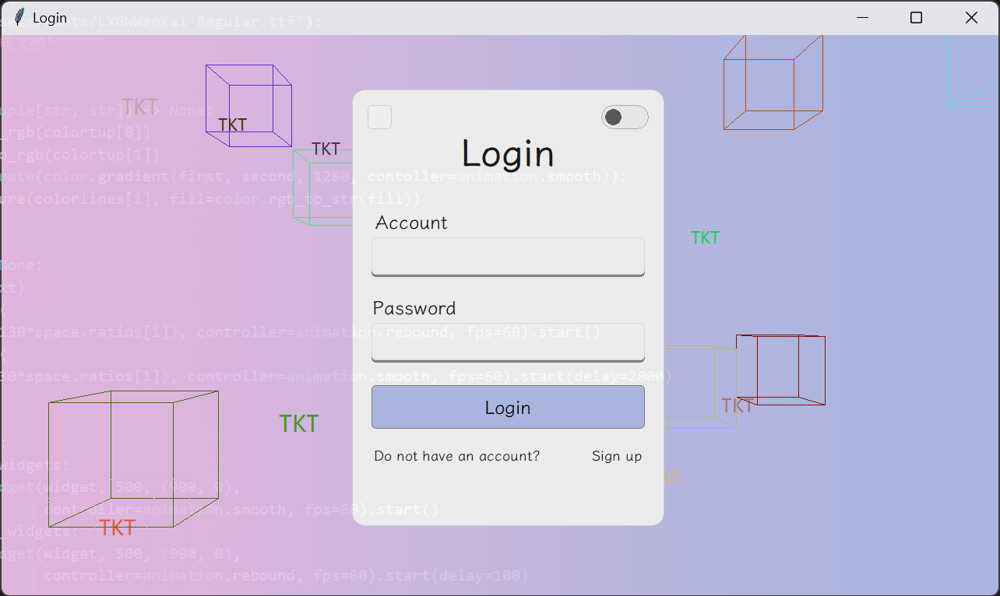

# 🔥 tkintertools-demos

Official demos for tkintertools package

🚀 tkintertools: https://github.com/Xiaokang2022/tkintertools

## 📑 Demos

### 0️⃣ [Basic Test](./demos/demo0/)

### 1️⃣ [Login Window](./demos/demo1/)

### 2️⃣ [Simple Game](./demos/demo2/)

### 3️⃣ [3D Performance Test](./demos/demo3/)

