# 🔥 tkintertools-demos

All official demos for tkintertools package

🚀 tkintertools: https://github.com/Xiaokang2022/tkintertools

<p>
<a href="https://github.com/Xiaokang2022/tkintertools-demos/watchers"></a>
<a href="https://github.com/Xiaokang2022/tkintertools-demos/forks"></a>
<a href="https://github.com/Xiaokang2022/tkintertools-demos/stargazers"></a>
<a href="https://github.com/Xiaokang2022/tkintertools-demos/issues"></a>
<a href="https://github.com/Xiaokang2022/tkintertools-demos/pulls"></a>
<a href="https://github.com/Xiaokang2022/tkintertools-demos/discussions"></a>
</p>

<p>
    <a href="https://star-history.com/#Xiaokang2022/tkintertools-demos&Date">
        <picture>
            <source media="(prefers-color-scheme: dark)" srcset="https://api.star-history.com/svg?repos=Xiaokang2022/tkintertools-demos&type=Date&theme=dark" />
            <source media="(prefers-color-scheme: light)" srcset="https://api.star-history.com/svg?repos=Xiaokang2022/tkintertools-demos&type=Date" />
            
        </picture>
    </a>
</p>

## 📑 Demos - `tkt 3`

> [!NOTE]  
> The demos here are all developed by `tkintertools 3`, they are all experimental versions, there may be some bugs, just for reference  
> 此处的 demo 均由 `tkintertools 3` 开发，都是实验版本，可能存在一些 bug，仅供参考

### 0️⃣ [Basic Test](./demos/demo0/)

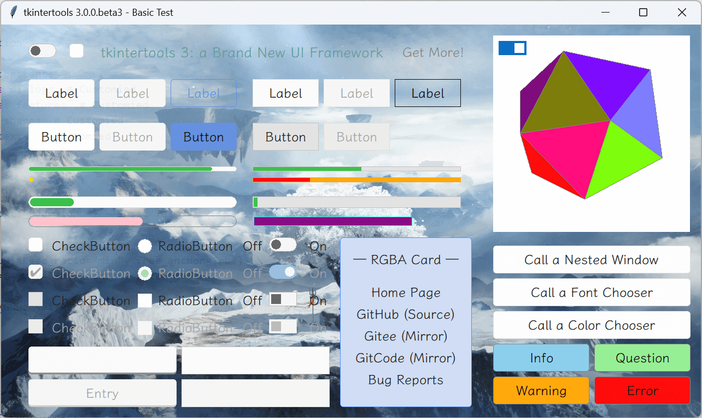

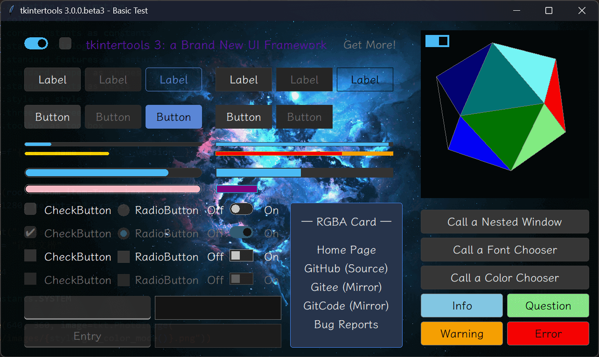

### 1️⃣ [Simple Project](./demos/demo1/)

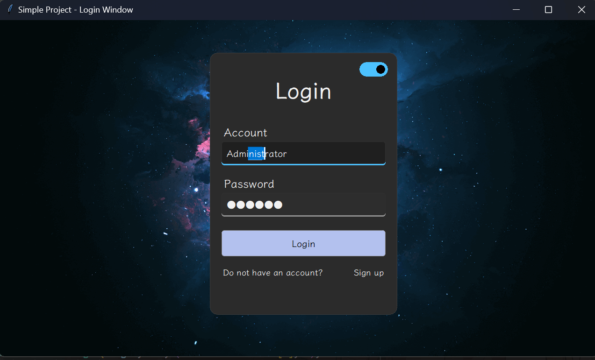


### 2️⃣ [Simple Game](./demos/demo2/)

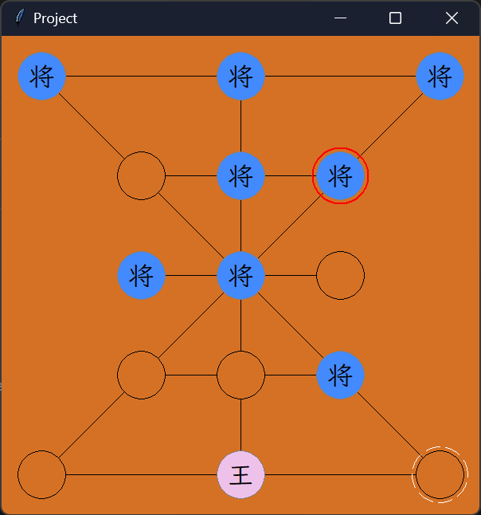

### 3️⃣ [Simple Login Window](./demos/demo3/)

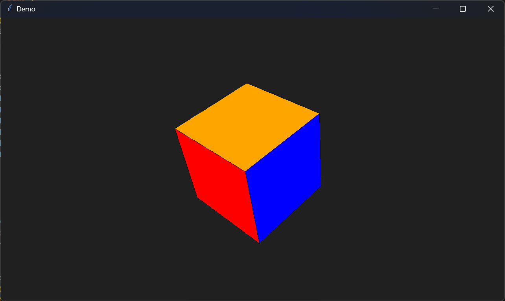

### 4️⃣ [Matplotlib Test](./demos/demo4/)

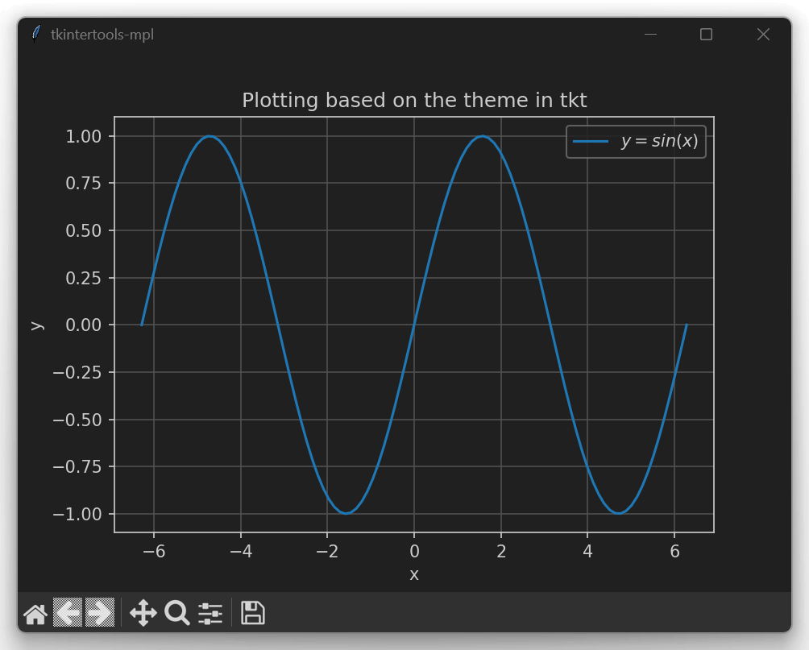

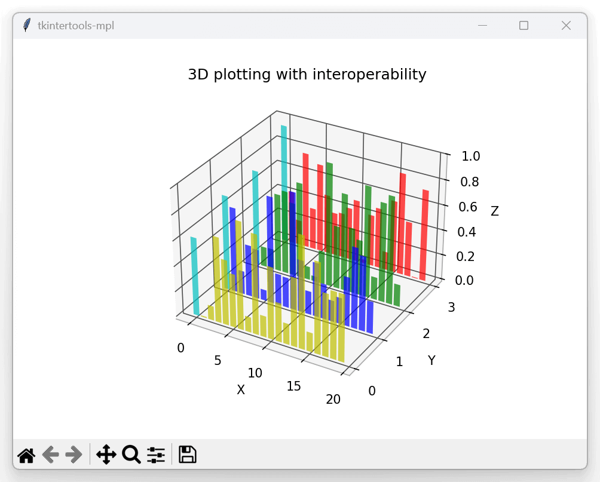

### 5️⃣ [Matplotlib Project](./demos/demo5/)

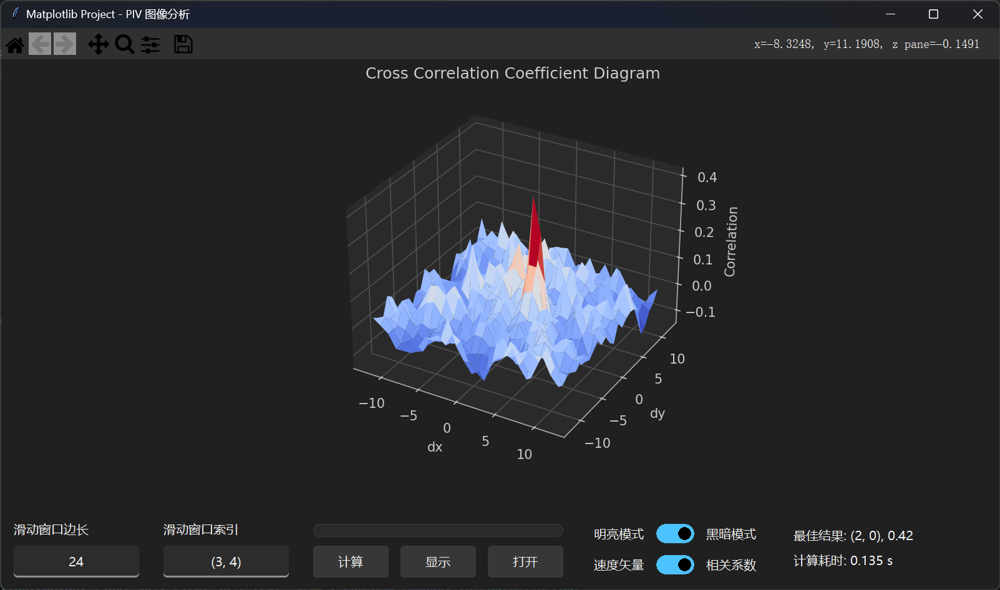

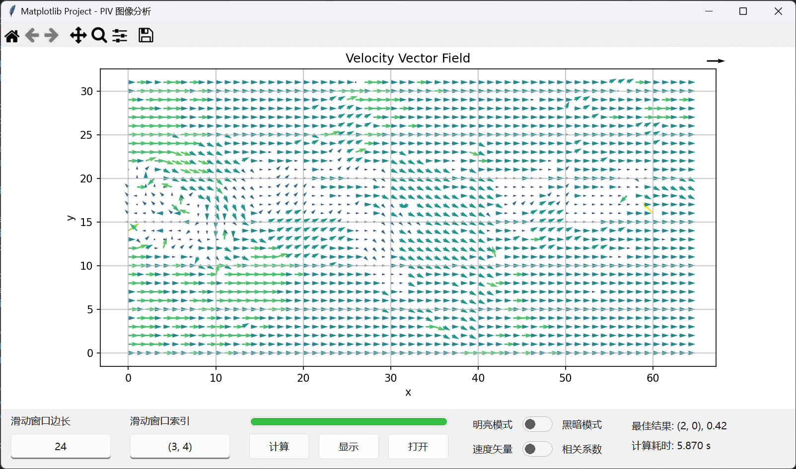

### 6️⃣ [3D Performance Test](./demos/demo6/)

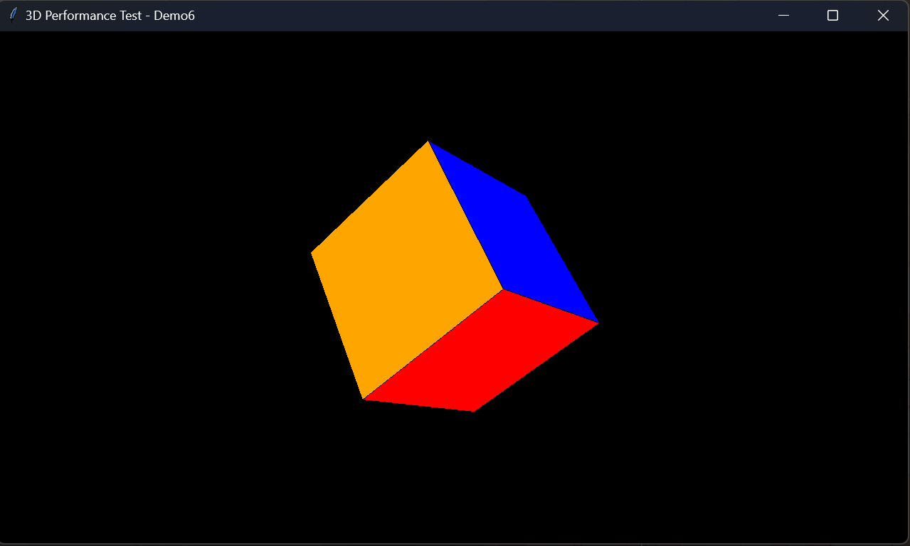

### 7️⃣ [3D Functional Test](./demos/demo7/)

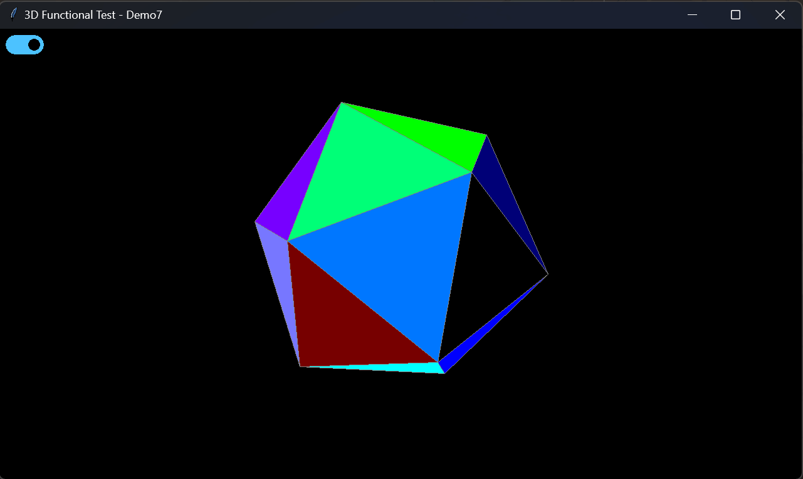

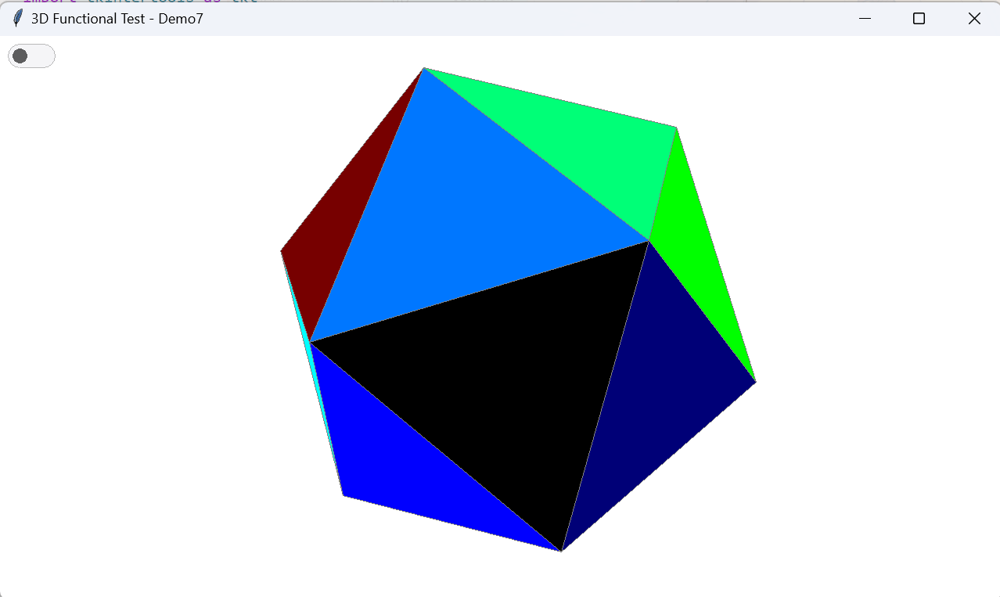

### 8️⃣ [3D Test](./demos/demo8/)

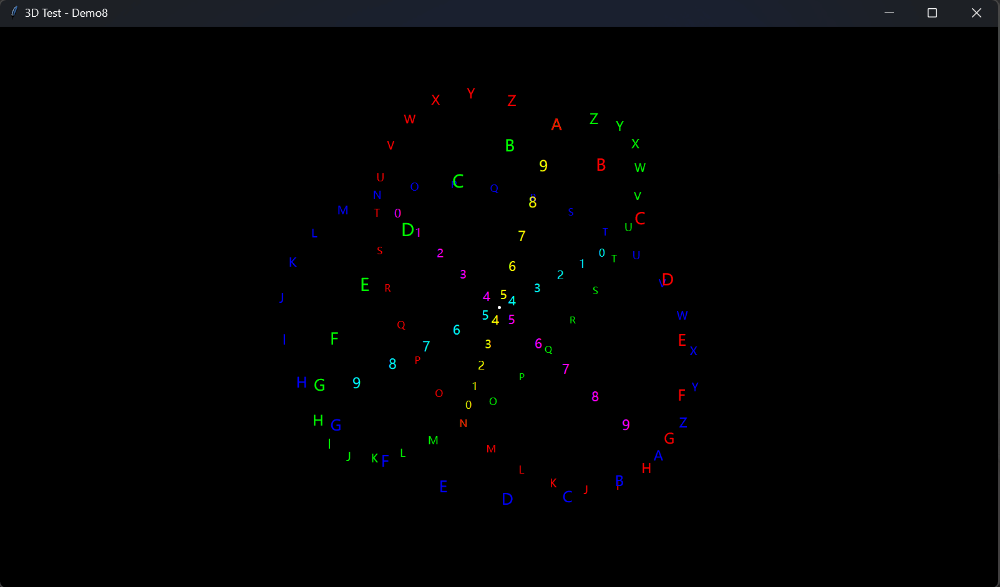

### 9️⃣ [New Features Test](./demos/demo9/)

> [!NOTE]  
> The demo requires the installation of the full `tkintertools` optional dependency package and all extension packages, and the latest commit of `tkintertools` (not `3.0.0.rc1`)  
> 该 demo 需要安装完整的 `tkintertools` 可选依赖包及全部扩展包，并保证 `tkintertools` 为最新的提交（并非 `3.0.0.rc1`）
> 
> ```
> git clone -b master https://github.com/Xiaokang2022/tkintertools.git
> python -m pip install --upgrade .\tkintertools\
> ```

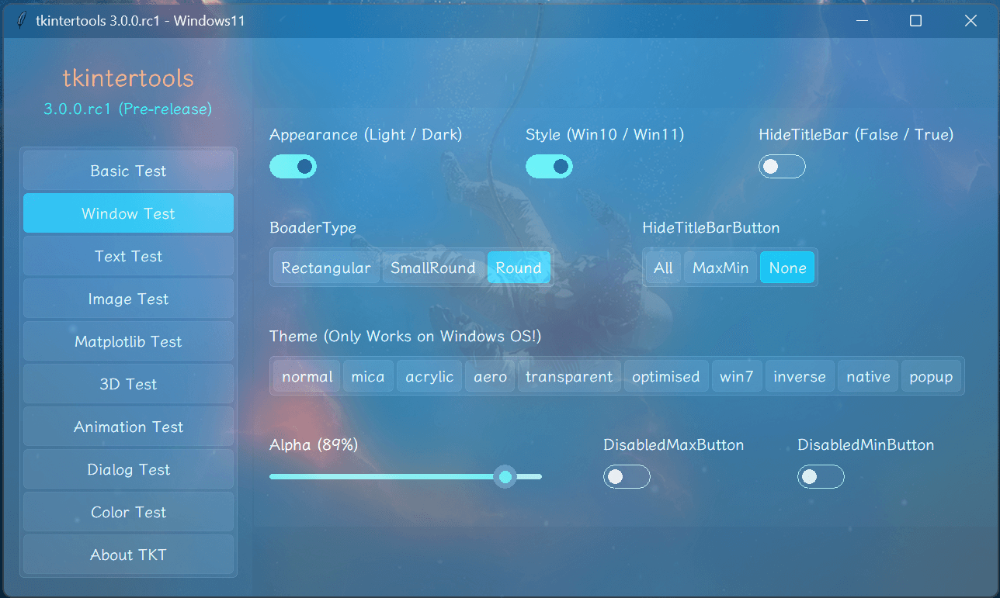

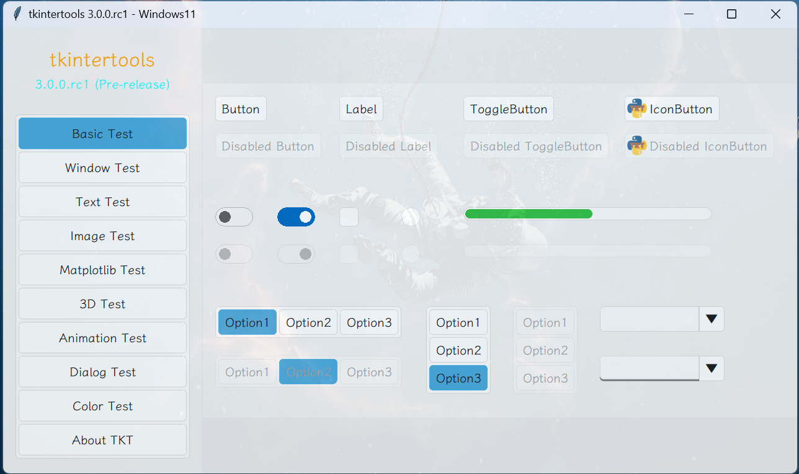

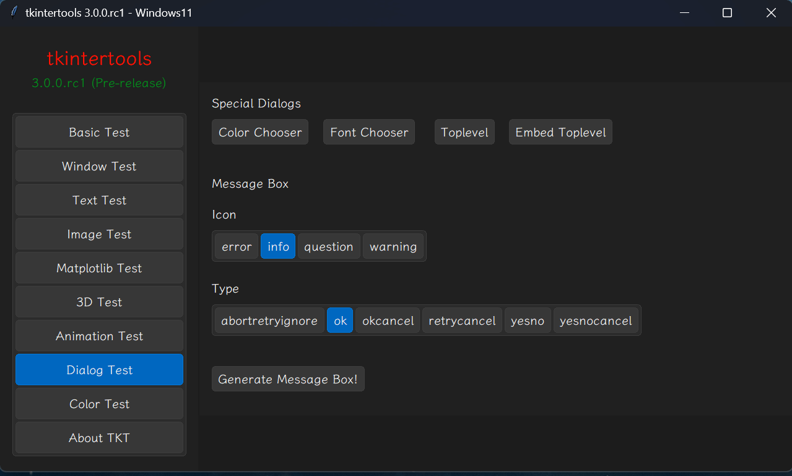

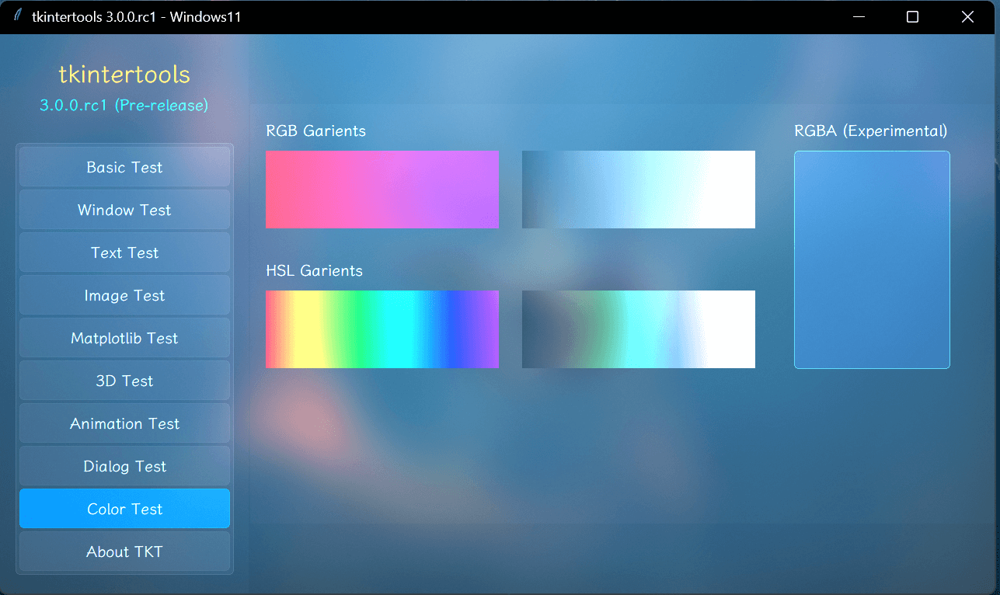

## 📑 Projects - `tkt 2`

> [!IMPORTANT]  
> The projects here are all developed by `tkintertools 2` and are mostly bug-free, but since `tkintertools 2` is no longer being updated, it is likely that they will not get any updates at all  
> 此处的项目均由 `tkintertools 2` 开发，基本不存在 bug，但由于 `tkintertools 2` 不再得到更新，因此它们大概率也不会再得到任何更新

### 1️⃣ Intelligent Magic Cube

* 🔖 Version / 版本: `1.2`
* 📦 Framework / 框架: `tkintertools 2.6.21.1`
* ✏️ Author / 作者: [Xiaokang2022](https://github.com/Xiaokang2022)
* 🚀 GitHub / 仓库: https://github.com/Xiaokang2022/Intelligent-Magic-Cube

<p>


</p>


### 2️⃣ Chinese Chess

* 🔖 Version / 版本: `1.8`
* 📦 Framework / 框架: `tkintertools 2.5.9.5`
* ✏️ Author / 作者: [Xiaokang2022](https://github.com/Xiaokang2022)
* 🚀 GitHub / 仓库: https://github.com/Xiaokang2022/Chess

<p>


</p>


### 3️⃣ Super Gobang

* 🔖 Version / 版本: `2.0`
* 📦 Framework / 框架: `tkintertools 2.6.21.1`
* ✏️ Author / 作者: [Xiaokang2022](https://github.com/Xiaokang2022)
* 🚀 GitHub / 仓库: https://github.com/Xiaokang2022/Super-Gobang

<p>


</p>


### 4️⃣ Todo List

* 🔖 Version / 版本: `1.0`
* 📦 Framework / 框架: `tkintertools 2.5.9`
* ✏️ Author / 作者: [Xiaokang2022](https://github.com/Xiaokang2022)
* 🚀 GitHub / 仓库: https://github.com/Xiaokang2022/TodoList

<p>


</p>

